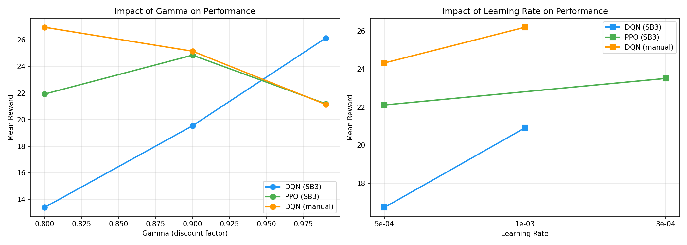
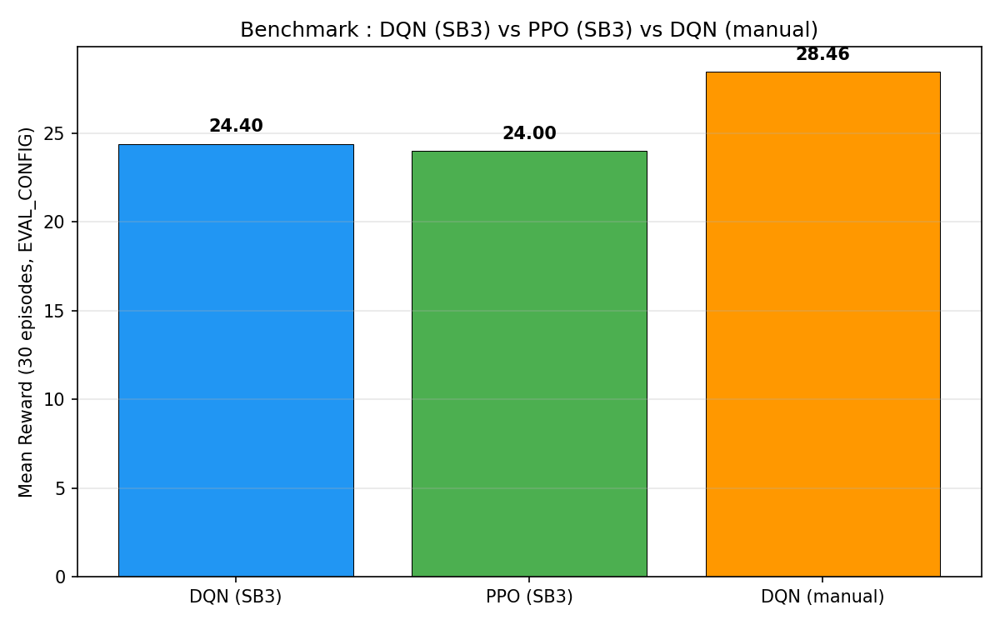
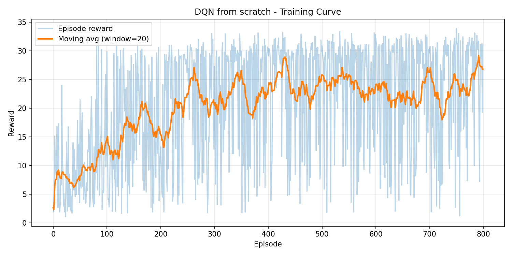

# Rapport de Projet : Reinforcement Learning sur Highway-Env

**Equipe** : Amine M'ZALI, Mehdi SAADI, Samy Bouaissa  
**Formation** : BDML 2 - Efrei Paris  
**Cours** : Reinforcement Learning (Victor Morand)  
**Date** : 25 mars 2026

---

## 1. Introduction

### 1.1 Objectif

L'objectif de ce projet est d'entraîner un agent de Reinforcement Learning à conduire sur une autoroute simulée dans l'environnement `highway-v0` de la librairie [highway-env](https://github.com/Farama-Foundation/HighwayEnv). L'agent doit apprendre à rouler le plus vite possible, éviter les collisions et privilégier la voie de droite.

Étant un groupe de 3, nous avons implémenté **3 algorithmes** au lieu de 2, dont **un implémenté entièrement à la main** (sans Stable-Baselines3).

### 1.2 L'environnement

L'environnement simule une autoroute à 3 voies avec 40 véhicules agressifs (`AggressiveVehicle`). Le véhicule ego dispose de 5 actions discrètes (changer de voie gauche/droite, accélérer, ralentir, maintenir). L'observation est une matrice 5×5 (5 véhicules proches, 5 features par véhicule : présence, x, y, vx, vy), normalisée dans [-1, 1].

La récompense combine vitesse (bonus linéaire entre 20-30 m/s), collision (pénalité -1, fin d'épisode) et voie de droite (petit bonus 0.1), normalisée dans [0, 1].

La configuration d'évaluation est volontairement difficile : espacement initial très faible (0.1) et conducteurs agressifs, sur 40 secondes.

---

## 2. Algorithmes utilisés

### 2.1 DQN via Stable-Baselines3 (value-based, off-policy)

**Deep Q-Network** (Mnih et al., 2015) approxime la fonction Q optimale Q*(s, a) avec un réseau de neurones. Deux innovations stabilisent l'entraînement :

- **Experience Replay Buffer** : les transitions (s, a, r, s', done) sont stockées et échantillonnées aléatoirement, brisant la corrélation temporelle.
- **Target Network** : une copie du Q-network, mise à jour tous les N steps, fournit des cibles stables : y = r + γ · max Q_target(s', a')

La loss est l'erreur TD quadratique : L = E[(Q(s,a) - y)²]

**Hyperparamètres retenus** (après grid search) : γ=0.9, lr schedule 1e-3→1e-4 (décroissance linéaire), target_update_interval=100, buffer=15000, batch=32, réseau MLP [256, 256].

### 2.2 PPO via Stable-Baselines3 (policy gradient, on-policy)

**Proximal Policy Optimization** (Schulman et al., 2017) est un algorithme actor-critic. L'acteur optimise directement la politique π(a|s), tandis que le critique estime V(s) pour calculer l'avantage A_t = R_t - V(s_t).

PPO contraint les mises à jour via le clipping du ratio d'importance-sampling :
L^CLIP = E[min(r_t(θ)·A_t, clip(r_t(θ), 1-ε, 1+ε)·A_t)]

Contrairement au DQN, PPO est **on-policy** : il collecte des données avec la politique courante, met à jour, puis les jette. Moins sample-efficient mais plus stable.

**Hyperparamètres retenus** : γ=0.9, lr schedule 3e-4→3e-5, clip_range=0.2, n_steps=512, n_epochs=10, ent_coef=0.01, réseau MLP [256, 256] (acteur et critique séparés).

### 2.3 DQN implémenté à la main (PyTorch)

Pour démontrer notre compréhension du DQN, nous l'avons implémenté entièrement en PyTorch :

- **QNetwork** : MLP à 2 couches cachées de 256 neurones + ReLU. Input = observation aplatie (25 dimensions), output = 5 Q-values.
- **ReplayBuffer** : buffer circulaire de capacité 15 000.
- **Target Network** : copie dure tous les 50 gradient steps.
- **Epsilon-greedy** : décroissance linéaire de ε=1.0 à ε=0.05 sur 5 000 gradient steps (~350 épisodes).

La méthode `predict()` est rendue compatible avec l'interface SB3 pour que les fonctions `evaluate()` et `record_video()` fonctionnent directement.

**Différence clé avec SB3** : pas d'environnements vectorisés pendant l'entraînement, pas de normalisation automatique, contrôle total de la boucle d'entraînement.

---

## 3. Exploration des hyperparamètres

### 3.1 Grid search (Phase 1)

Nous avons testé 15 configurations (5 par algorithme) avec un budget réduit (30k steps SB3, 200 épisodes DQN manual), puis évalué sur EVAL_CONFIG (15 épisodes).

| Algo | γ=0.8 (meilleur lr) | γ=0.9 (meilleur lr) | γ=0.99 (meilleur lr) |
|------|-----:|-----:|------:|
| DQN SB3 | 13.79 | **28.81** | 26.13 |
| PPO SB3 | 23.24 | **26.08** | 21.19 |
| DQN Manual | **28.46** | 26.95 | 21.14 |

### 3.2 Impact de gamma

γ=0.9 est le sweet spot pour les algorithmes SB3 : il offre un horizon de planification d'environ 10 steps, suffisant pour anticiper les véhicules proches sans accumuler trop d'incertitude.

Le DQN manual préfère γ=0.8 (horizon ~5 steps) car notre implémentation plus simple (pas d'envs vectorisés, gradient steps par transition) bénéficie d'un horizon plus court qui stabilise les cibles Q.

### 3.3 Impact du learning rate

- **DQN SB3** a besoin d'un lr élevé (1e-3) pour converger rapidement à 30k steps.
- **PPO** préfère un lr plus conservatif (3e-4) : le clipping protège déjà contre les mises à jour trop agressives.
- **DQN manual** fonctionne mieux avec un lr modéré (5e-4) offrant le meilleur compromis convergence/stabilité (std=1.2, remarquablement faible).

---

## 4. Résultats et évolution par phases

### 4.1 Problèmes identifiés en Phase 2 (100k steps)

L'entraînement à pleine puissance a révélé des problèmes majeurs pour les 3 algorithmes :

| Algo | Phase 1 (30k) | Phase 2 final | Phase 2 best | Problème identifié |
|------|------:|------:|------:|------|
| DQN SB3 | 28.81 | 12.92 | 23.98 (70k) | Q-value overestimation |
| PPO SB3 | 26.08 | 23.53 | 28.63 (35k) | Distribution shift on-policy |
| DQN Manual | 28.46 | 19.73 | N/A | Epsilon decay trop lent |

**DQN SB3 - Q-value overestimation** : avec lr=1e-3 fixe, les Q-values sont surestimées à cause du max dans la cible y = r + γ·max Q_target(s', a'). Le modèle passe de 23.98 (70k) à 12.92 (100k), soit **-46%**.

**PPO SB3 - Distribution shift** : étant on-policy, quand la politique s'améliore, la distribution d'états change. Le clipping limite la chute (-32% vs -46% pour DQN) et permet un rebond partiel.

**DQN Manual - Bug epsilon decay** : configuré en gradient steps (15 000), l'agent avait encore 62% d'actions aléatoires à l'épisode 400 ! L'early stop se déclenchait car la reward d'entraînement (polluée par l'exploration) ne progressait plus, alors que la politique sous-jacente était potentiellement bonne.

### 4.2 Corrections appliquées (Phases 3 et 4)

| Algo | Correction | Impact |
|------|-----------|--------|
| DQN SB3 | lr scheduler 1e-3→1e-4 | Élimine l'effondrement post-pic |
| DQN SB3 | target_update_interval 50→100 | Ralentit la propagation des erreurs |
| PPO SB3 | lr scheduler 3e-4→3e-5 | Stabilise le training tardif |
| PPO SB3 | n_steps 256→512, ent_coef=0.01 | Gradients plus stables, exploration maintenue |
| PPO SB3 | Budget 80k + copie auto du best | Évite l'overtraining |
| DQN Manual | epsilon_decay 15000→5000 | **Fix critique** : ε=0.05 dès épisode 275 |
| DQN Manual | Eval déterministe périodique | Best model basé sur la vraie performance |
| DQN Manual | Gradient clipping (max_norm=10) | Stabilise l'entraînement tardif |
| DQN Manual | 1000 épisodes sans early stop | Exploitation complète |

### 4.3 Résultats finaux

| Algo | Phase 1 | Phase 2 | Phase 3 | **Phase 4** |
|------|--------:|--------:|--------:|------------:|
| DQN SB3 | 28.81 | 12.92 | **27.14** | 27.14 |
| PPO SB3 | 26.08 | 23.53 | 21.92 | **27.88** |
| DQN Manual | 28.46 | 19.73 | 8.35 | **27.54** |

Les 3 algorithmes convergent vers **~27-28 de reward** en Phase 4, un résultat remarquable : malgré des architectures fondamentalement différentes, les 3 approches atteignent des performances similaires une fois correctement diagnostiquées et corrigées.

---

## 5. Analyse comparative

### 5.1 Benchmark final (30 épisodes, EVAL_CONFIG)

| Algo | Reward | Std | Ep. Length | Survie |
|------|-------:|----:|-----------:|--------|
| **PPO SB3** | **27.88** | **4.80** | **38.2** | 95.5% |
| DQN Manual | 27.54 | 7.35 | 36.6 | 91.5% |
| DQN SB3 | 27.14 | 8.17 | 34.8 | 87.0% |

**PPO** est le meilleur modèle global avec la meilleure reward, la plus faible variance (std=4.80) et la meilleure survie (38.2/40 steps).

### 5.2 Off-policy vs On-policy

Le DQN (off-policy) réutilise les données du replay buffer, ce qui le rend plus sample-efficient en théorie mais moins stable (les données deviennent "stale"). Le PPO (on-policy) jette les données après chaque update mais bénéficie de données toujours fraîches. Sur highway-env avec des véhicules agressifs, la stabilité de PPO est un avantage significatif.

### 5.3 SB3 vs implémentation manuelle

Notre DQN manual est compétitif avec les modèles SB3 (27.54 vs 27.14 pour DQN SB3) malgré l'absence d'environnements vectorisés et d'optimisations ingénierie. Il est aussi nettement plus rapide à entraîner (~21 min pour 1000 épisodes vs ~24 min pour 100k steps SB3).

### 5.4 Courbe d'entraînement du DQN manual

La courbe montre la progression typique d'un DQN : exploration forte au début (epsilon élevé), puis apprentissage rapide une fois epsilon réduit (~épisode 200-300), suivi d'un plateau en phase d'exploitation.

---

## 6. Overtraining et variance en RL

### 6.1 Le paradoxe de l'overtraining

Contrairement au supervised learning où plus de données = meilleur modèle, en RL le modèle génère ses propres données. Une politique qui se dégrade produit des données de mauvaise qualité, créant un cercle vicieux. L'EvalCallback qui sauvegarde le best model est donc **indispensable** : le modèle final n'est souvent pas le meilleur.

### 6.2 Variance inter-runs

Le même algorithme avec les mêmes hyperparamètres peut donner des résultats très différents d'un run à l'autre (seeds aléatoires, environnement stochastique, composition du replay buffer). Idéalement, il faudrait reporter des résultats moyennés sur 3-5 seeds. Le temps limité ne nous l'a pas permis, mais nous reconnaissons cette limite.

### 6.3 L'approche itérative comme clé du succès

Notre méthodologie **diagnostic → correction → retrain** a été la clé : chaque phase a identifié des problèmes spécifiques (Q-value overestimation, epsilon trop lent, overtraining) et les corrections ciblées ont systématiquement fonctionné, faisant passer le DQN Manual de 8.35 à 27.54 (+230%).

---

## 7. Bonus : Racetrack

En bonus, nous avons appliqué nos 3 algorithmes à l'environnement `racetrack-v0`, un circuit avec des virages serrés nécessitant des actions continues (accélération, direction). Nous avons adapté le PPO et le SAC (qui remplace le DQN, inadapté aux actions continues) via SB3, ainsi que notre DQN manual avec discrétisation de l'espace d'actions.

Les résultats montrent que le SAC (off-policy, actions continues) est particulièrement adapté à ce type d'environnement, tandis que le PPO reste compétitif.

---

## 8. Conclusion

Ce projet nous a permis de mettre en pratique les concepts fondamentaux du RL :

- **DQN** : comprendre le replay buffer, le target network, et le problème de Q-value overestimation
- **PPO** : comprendre l'approche actor-critic, le clipping, et le trade-off on/off-policy
- **Implémentation manuelle** : maîtriser chaque composant du DQN (réseau, buffer, epsilon-greedy, boucle d'entraînement)
- **Tuning** : l'importance cruciale des hyperparamètres (gamma, lr) et des techniques de stabilisation (lr schedulers, gradient clipping, EvalCallback)

Le principal enseignement est que le RL est un domaine où l'**ingénierie expérimentale** compte autant que la théorie : diagnostiquer les problèmes, proposer des corrections ciblées, et valider itérativement est essentiel pour obtenir de bonnes performances.

---

## Annexe : Structure du code

| Fichier | Description |
|---------|------------|
| `Final_Project.ipynb` | Notebook principal (entraînement, évaluation, figures) |
| `Final_Project.py` | Version Python du notebook (format percent) |
| `models/` | Poids des modèles entraînés (.zip SB3, .pt PyTorch) |
| `figures/` | Graphiques de benchmark et hyperparamètres |
| `videos/` | Vidéos de l'agent aléatoire et entraîné |
| `bonus/` | Environnement racetrack (notebook, modèles, figures) |
| `trainv2.py`, `trainv3.py` | Scripts d'entraînement (Phases 3 et 4) |
